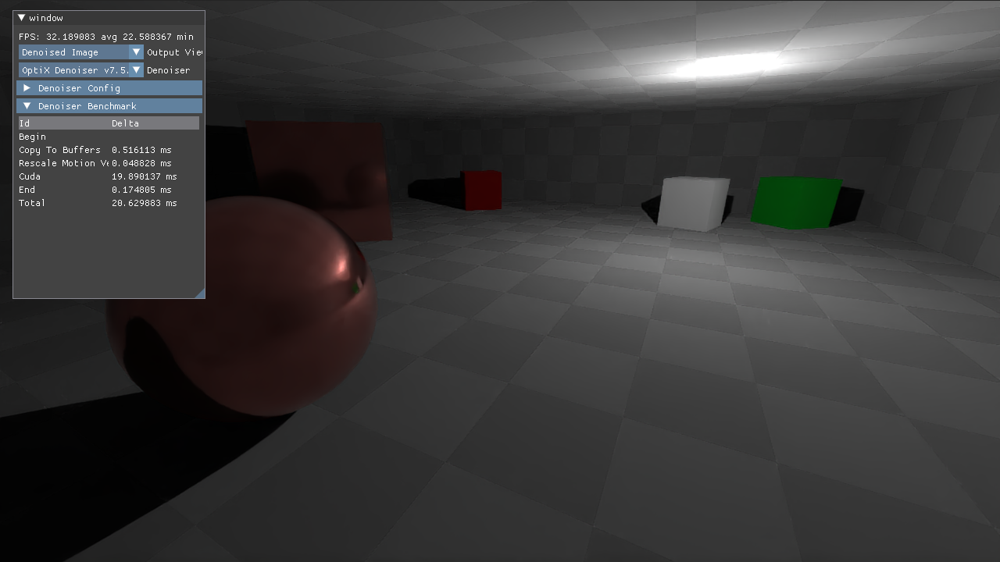
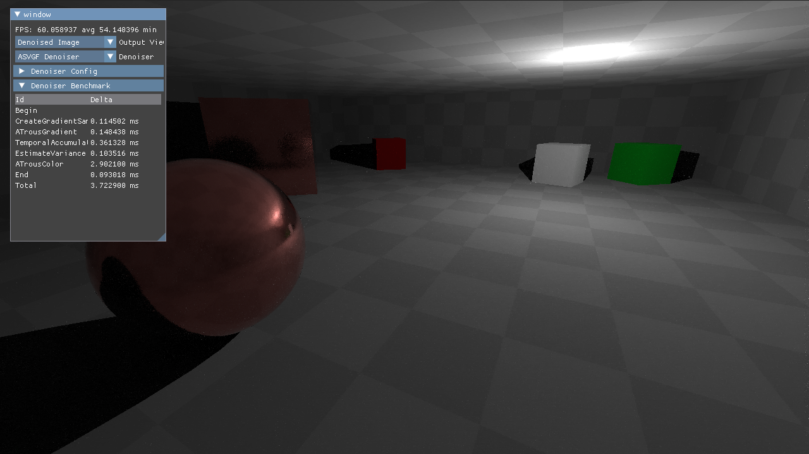

Demo application showcasing multiple ray tracing denoiser implementations, based on the [Foray Library](https://github.com/Vulkemp/foray)

# Implemented Denoisers
## OptiX (2017)

Interactive Reconstruction of Monte Carlo Image Sequences using a Recurrent Denoising Autoencoder

Chakravarty R. Alla Chaitanya (NVIDIA), Anton Kaplanyan (NVIDIA), Christoph Schied, Marco Salvi, Aaron Lefohn ,Derek Nowrouzezahrai (McGill University), Timo Aila



NOTE: Currently semaphore handle export on windows is broken. Works on linux.
NOTE: Requires OptiX header directory configured in CMakeCache and CUDA Toolkit

Links
* [Paper](https://research.nvidia.com/publication/2017-07_interactive-reconstruction-monte-carlo-image-sequences-using-recurrent)
* [OptiX SDK Download](https://developer.nvidia.com/designworks/optix/download)

## A-SVGF (2018)
Gradient Estimation for Real-Time Adaptive Temporal Filtering

Christoph Schied, Christoph Peters, and Carsten Dachsbacher, Karlsruhe Institute of Technology, Germany



Links
* [Paper](https://cg.ivd.kit.edu/publications/2018/adaptive_temporal_filtering/adaptive_temporal_filtering.pdf)
* [Example Implementation](https://cg.ivd.kit.edu/publications/2018/adaptive_temporal_filtering/a_svgf.zip)

# Setup
```sh
git clone --recursive https://github.com/Vulkemp/foray-denoising
```
## For OptiX
By default, OptiX is disabled due to further dependencies on Cuda and OptiX headers.
* Set ENABLE_OPTIX option in CMake Cache
* Follow further instructions in [denoisers/foray-denoiser-optix/setupcuda.md](./denoisers/foray-denoiser-optix/setupcuda.md)
